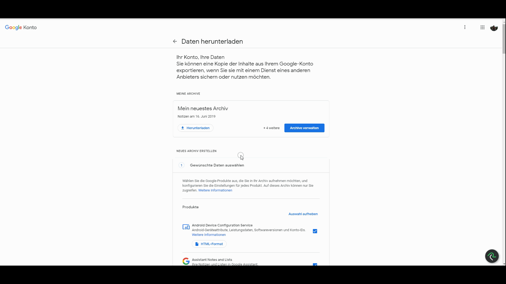

<!-- 

 **DO NOT EDIT THIS FILE.** Make changes to `_readme.md`, and that will be used to create this file -->

<link rel="shortcut icon" href="data:image/png;base64,iVBORw0KGgoAAAANSUhEUgAAACAAAAAgCAYAAABzenr0AAAABGdBTUEAALGPC/xhBQAAACBjSFJNAAB6JgAAgIQAAPoAAACA6AAAdTAAAOpgAAA6mAAAF3CculE8AAAABmJLR0QAAAAAAAD5Q7t/AAAACXBIWXMAAA3XAAAN1wFCKJt4AAAAB3RJTUUH4wsBDyUWhBO3cwAAA0FJREFUWMPtl79O21AUxu+JPQQbR7WQErXqEBgTVIwqVZUi4b2K0xdosvAIfQbYu/ACCJQlI6FMllBVQiQaaAJSqmJ1aBXGMEWOff11uaauyR/UQsvAlc5i+dzvd8/1vf4OY/dtACgC2AEwwO2NAYD3AKxJwkkAmwBg23bXMIymoih9IgJj7I+CiKAoSn9paalp23ZXwGwCSI4C2OSc+6VS6YCIgj8VnQATWJZ1wDn3AWyOKjssyzq4beF4WJZ1ICpRjALs2LbdvYuVj6qE2I6dKMDAMIzmXYuHYRhGE8AgCgBFUfr/CkBRlD4AMMYYhQCJRIKJZ3c+iIgFQcCIiBKRKvwT8bhW4i/muZXxAPAAcP8BZFkeqqp6Kcuyf9NJJUnyUqnUpSzL7o0SxK30W8zPz7fr9XrH930fAFzXHW5vb7cymcwXNuaGS6fT3Wq12nJddwgAvu/7e3t7nYWFhVb8XUQvgzhAuVxuBEEAAIcAXgN4CqAC4MzzPL9QKDTiExYKhYbneT6AMwBvADwRf9kPALC6utq8EUAulzsSv8sNAFKsUkkANc/z/HQ63Q1zMpnMFyFei5sNABKAdwCwuLh4NBXg+PjYAbAfF49BnFWr1U9hztbW1hGA7kin8wvCbrfb30KHNRJA07QLsfrClG/mjeu6Q0mShrIse2LPK1NyXgKApmm9sQC6rp8KAylNmewxAKRSqb6qqn0B/XRKjgRgMDc3dxoFuDqGRMQ4548YY0nGWJ5NHi8453wwGMy4rjvDOeeMsedTcvKMsaTruhoRXaND6IAdx+kBqE1ZyeHu7m4n/Abq9XpHnBhpQl7NcZxe6JTjW3BlyUzTbIiSvh0jvhEEAbLZ7EkIkM1mP4tjuzEKAsBbADBNs8HGWLIrU0pEWFtbawqIGoBnQrggTgcqlcq1e6BcLofg++JdSeTWAGB9fb1JRGNN6auoLScirKysNM7Pz79HOhucnJw4uVzuKC4eRj6fb7Vara/RHMdxeqZpNsLjVyqVrttyAXGtMSEiaJr2Q9f1U1VVe+OE4zE7O3uh6/qppmk/QmEiCorF4seRjYkA+K01W15evrXWzDCM6a1ZBOSumtMdTGpO/9f4CY26gJKVH22dAAAAJXRFWHRkYXRlOmNyZWF0ZQAyMDE5LTExLTAxVDE1OjM3OjIyKzAxOjAwXudprAAAACV0RVh0ZGF0ZTptb2RpZnkAMjAxOS0xMS0wMVQxNTozNzoyMiswMTowMC+60RAAAAAZdEVYdFNvZnR3YXJlAHd3dy5pbmtzY2FwZS5vcmeb7jwaAAAAAElFTkSuQmCC">

[logo]: https://lh3.googleusercontent.com/-PBpwx8wmdzU/XrZUXsA7D6I/AAAAAAAAVP0/VVGw_usHyFkxuyHN3FYQXzJioP4VegmMACK8BGAsYHg/s0/2020-05-08.png "Logo Title Text 2"

# UserScripts
Userscripts for automating / improving browser experience

## Instalation instructions
https://tampermonkey.net/faq.php#Q100
or
https://greasyfork.org/en

Many of the scripts depend on the All Pages script, it injects some global functions that might be used by other scripts, it needs to be installed first so it runs before the other ones

Quick Preview:

<!-- Preview table will be appended at the end of the document) -->

| Name / File | Description / Match |
|---|---|
| [Old UserScripts](old/) | Older Userscripts | 
| **Airbnb**   [Source Code](https://github.com/aljgom/UserScripts/blob/master/./airbnb.user.js "Source Code") [Download/Install](https://aljgom.github.io/UserScripts/./airbnb.user.js "Download/Install")| Moves the calendar to the top of the page to be able to see availability easily If you add &loadCals=1 to the url, it will load all the links in the 'rooms' array, and clone their calendars into the main page to have them all in one Also highlights todays date on all of them, showing green for available and red for unavailable if you use loadCals=2 it runs another version, in which it makes direct calls to the airbnb API to get only the calendar data for the bookings, and creates a visualization for all of the days   _Match:_   ``https://www.airbnb.com/rooms/*``   |
| **Airbnb Multicalendar**   [Source Code](https://github.com/aljgom/UserScripts/blob/master/./airbnb_multicalendar.user.js "Source Code") [Download/Install](https://aljgom.github.io/UserScripts/./airbnb_multicalendar.user.js "Download/Install")| Adds guest photos to the bookings in the multicalendar Changes the background color of bookings that include today, to show check outs, check ins, and current guests\. Creates a set with all the guests for the current day   _Match:_   ``https://www.airbnb.com/multicalendar``   |
| **All Pages**   [Source Code](https://github.com/aljgom/UserScripts/blob/master/./all_pages.user.js "Source Code") [Download/Install](https://aljgom.github.io/UserScripts/./all_pages.user.js "Download/Install")| adds global functions/variables, other scripts depend on these   _Match:_   ``http://*/*`` ``https://*/*``   |
| **Clipper**   [Source Code](https://github.com/aljgom/UserScripts/blob/master/./clipper.user.js "Source Code") [Download/Install](https://aljgom.github.io/UserScripts/./clipper.user.js "Download/Install")| Automate reload cash process Goes through muiltiple clicks to get through the add cash forms, checkout buttons, card selection, accepting terms of service Leaving only the last "Place order" click to be made   _Match:_   ``https://*.clippercard.com/*``   |
| **Code Signals**   [Source Code](https://github.com/aljgom/UserScripts/blob/master/./code_signals.user.js "Source Code") [Download/Install](https://aljgom.github.io/UserScripts/./code_signals.user.js "Download/Install")| Run code when F5 is pressed, prevent reload, and handle how output is displayed Uses waitFor function from All Pages script   _Match:_   ``https://app.codesignal.com/*``   |
| **Ebay**   [Source Code](https://github.com/aljgom/UserScripts/blob/master/./ebay.user.js "Source Code") [Download/Install](https://aljgom.github.io/UserScripts/./ebay.user.js "Download/Install")| Modifications to pages in ebay, filtering out results, loading delivery dates for items in results page, etc   _Match:_   ``https://www.ebay.com/sch/*`` ``https://www.ebay.com/itm/*`` ``https://pay.ebay.com/*``   |
| **Focus on one task**   [Source Code](https://github.com/aljgom/UserScripts/blob/master/./focus_on_one.user.js "Source Code") [Download/Install](https://aljgom.github.io/UserScripts/./focus_on_one.user.js "Download/Install")| Prompts for what is the highest priority task or enter a new one by writing 'new' in the prompt, for each tab that is opened, it asks what task it is for\. Re\-focuses on the tabs of the most important task   _Match:_   ``http://*/*`` ``https://*/*``   |
| **Gmail Reload Lost Page**   [Source Code](https://github.com/aljgom/UserScripts/blob/master/./gmail_reload_lost_page.user.js "Source Code") [Download/Install](https://aljgom.github.io/UserScripts/./gmail_reload_lost_page.user.js "Download/Install")| Reloads tabs that were opened from another gmail window and lost reference to it and now display nothing\. Redirects them to a new url that works, matching the email ID This could be used as a bookmarklet instead as well, just using the redirection without checking for when to run it and doing it manually as needed This uses a lot of ram, since each tab reloads a whole new Gmail page instead of all referencing to one \(as expected, but keep it in mind\)   _Match:_   ``https://mail.google.com/?ui=2&view=btop*``   |
| **Google Doc Mirror**   [Source Code](https://github.com/aljgom/UserScripts/blob/master/./google_doc_mirror.user.js "Source Code") [Download/Install](https://aljgom.github.io/UserScripts/./google_doc_mirror.user.js "Download/Install")| Mirrors the content of the google doc in a new window\. If the window is clicked the whole content is selected so it can be copied easily   _Match:_   ``https://docs.google.com/document/d/*``   |
| **Google Keep**   [Source Code](https://github.com/aljgom/UserScripts/blob/master/./google_keep.user.js "Source Code") [Download/Install](https://aljgom.github.io/UserScripts/./google_keep.user.js "Download/Install")| Additional functionality and UI changes for Google Keep   _Match:_   ``https://keep.google.com/*``   |
| **Google Keep Backup**   [Source Code](https://github.com/aljgom/UserScripts/blob/master/./google_keep_backup.user.js "Source Code") [Download/Install](https://aljgom.github.io/UserScripts/./google_keep_backup.user.js "Download/Install")| Deselects all products and selects Google Keep to back it up   _Match:_   ``https://takeout.google.com/settings/takeout`` ``https://takeout.google.com/settings/takeout/`` ``https://bitly.com/a/warning?hash=2QQtLmu*``   |
| **Google Sheets Scroll**   [Source Code](https://github.com/aljgom/UserScripts/blob/master/./google_sheets_scroll.user.js "Source Code") [Download/Install](https://aljgom.github.io/UserScripts/./google_sheets_scroll.user.js "Download/Install")| Scroll to certain position when google sheet loads   _Match:_   ``https://docs.google.com/spreadsheets/d/*``   |
| **HackerRank/FireIO**   [Source Code](https://github.com/aljgom/UserScripts/blob/master/./hackerrank_firecode.user.js "Source Code") [Download/Install](https://aljgom.github.io/UserScripts/./hackerrank_firecode.user.js "Download/Install")| Run code when F5 is pressed, prevent reload, and handle how output is displayed Uses waitFor function from All Pages script   _Match:_   ``https://www.hackerrank.com/*`` ``https://www.firecode.io/problems/index``   |
| **Instant Login**   [Source Code](https://github.com/aljgom/UserScripts/blob/master/./instant_login.user.js "Source Code") [Download/Install](https://aljgom.github.io/UserScripts/./instant_login.user.js "Download/Install")| Automates login forms to log in automatically to pages\. I use it in conjunction with a password manager \(LastPass\), and it clicks log in buttons after LastPass fills up the required fields Uses WaitFor function defined in All Pages script   _Match:_   ``http://*/*`` ``https://*/*``   |
| **Keep Session Alive**   [Source Code](https://github.com/aljgom/UserScripts/blob/master/./keep_session_alive.user.js "Source Code") [Download/Install](https://aljgom.github.io/UserScripts/./keep_session_alive.user.js "Download/Install")| Prevents session ending   _Match:_   ``https://www.53.com/fifththird/html/session-timeout-warning-update.html`` ``https://www.53.com/fifththird/html/session-timeout-warning.html`` ``https://*.chase.com/*`` ``https://*.discover.com/*`` ``https://online.americanexpress.com/*`` ``https://creditwise.capitalone.com/*`` ``https://my.lendingtree.com/*`` ``https://wwws.mint.com/*`` ``https://online.penfed.org/PenFedOnline/*`` ``https://www.quizzle.com/*`` ``https://tcfbank.com/*`` ``https://digitalbanking.tcfbank.com/*`` ``https://secure.creditsesame.com/*`` ``https://services1.capitalone.com/*`` ``https://services2.capitalone.com/*`` ``https://secure.bankofamerica.com/*`` ``https://myaccounts.capitalone.com/*``   |
| **Life Countdown**   [Source Code](https://github.com/aljgom/UserScripts/blob/master/./life_countdown.user.js "Source Code") [Download/Install](https://aljgom.github.io/UserScripts/./life_countdown.user.js "Download/Install")| Adds a countdown to the bottom corner of every page, that counts down how many years, months, days, hours, minutes, seconds until a specified date runs it only while the page is focused, and pauses it when it's not   _Match:_   ``http://*/*`` ``https://*/*``   |
| **Meetup Hide Results**   [Source Code](https://github.com/aljgom/UserScripts/blob/master/./meetup_hide_results.user.js "Source Code") [Download/Install](https://aljgom.github.io/UserScripts/./meetup_hide_results.user.js "Download/Install")| Adds an \[x\] to each search result, if clicked it will hide all meetups from that group in this and future searches   _Match:_   ``https://www.meetup.com/find/events/*``   |
| **OneTab**   [Source Code](https://github.com/aljgom/UserScripts/blob/master/./onetab.user.js "Source Code") [Download/Install](https://aljgom.github.io/UserScripts/./onetab.user.js "Download/Install")| additions to the OneTab 'share as website' page\. Prompting for tab titles, adding buttons for opening all links, opening all automatically if url contains openAll=true   _Match:_   ``https://www.one-tab.com/page/*``   |
| **Pomodoro**   [Source Code](https://github.com/aljgom/UserScripts/blob/master/./pomodoro.user.js "Source Code") [Download/Install](https://aljgom.github.io/UserScripts/./pomodoro.user.js "Download/Install")| At every 25, or 55 minutes in each hour, it will add a black modal with a 5 minute timer to cover all webpages, and open another window to focus on during that time \(eg\. to\-do list\) If the modal is clicked, it will dissapear briefly, it will also focus on the other window Keeps track if the browser has been active to skip the next break if there hasn't been activity   _Match:_   ``http://*/*`` ``https://*/*``   |
| **Sprint reload until chat**   [Source Code](https://github.com/aljgom/UserScripts/blob/master/./sprint_reload_until_chat.user.js "Source Code") [Download/Install](https://aljgom.github.io/UserScripts/./sprint_reload_until_chat.user.js "Download/Install")| \-   _Match:_   ``https://www.sprint.com/*``   |
| **Stackoverflow**   [Source Code](https://github.com/aljgom/UserScripts/blob/master/./stackoverflow.user.js "Source Code") [Download/Install](https://aljgom.github.io/UserScripts/./stackoverflow.user.js "Download/Install")| Remove language / topic from title so it won't be cluttered   _Match:_   ``https://stackoverflow.com/questions*``   |
| **Temp Scripts**   [Source Code](https://github.com/aljgom/UserScripts/blob/master/./temp.user.js "Source Code") [Download/Install](https://aljgom.github.io/UserScripts/./temp.user.js "Download/Install")| Short/temporary scripts that having a separate page for each seems overkill   _Match:_   ``http://*/*`` ``https://*/*``   |
| **Youtube**   [Source Code](https://github.com/aljgom/UserScripts/blob/master/./youtube.user.js "Source Code") [Download/Install](https://aljgom.github.io/UserScripts/./youtube.user.js "Download/Install")| Various modifications: Loop and reverse playlist Autoreload on error Download mp3 Change speed for playlist Skip videos in playlist Add a remote control mini window Select highest resolution Close 'click here' anotations Get rid of recommendations Add Date to fullscren title, skip videos depening on date Keyboard speed control Add Playlist name to Tab Title Button to pause/play all active videos at once \-  When multiple videos are being played at the same time, this button will pause them all, and restart playing them if pressed again, while leaving other videos alone   _Match:_   ``http://www.youtube.com/watch*`` ``https://www.youtube.com/watch*`` ``https://www.youtube.com/*`` ``http://www.youtube.com/embed*`` ``https://www.youtube.com/embed*`` ``https://ycapi.org/*``   |
| **Youtube Continuous Play**   [Source Code](https://github.com/aljgom/UserScripts/blob/master/./youtube_continuous_play.user.js "Source Code") [Download/Install](https://aljgom.github.io/UserScripts/./youtube_continuous_play.user.js "Download/Install")| When playing in the background for a long time, youtube will eventually stop the video and ask if we want to contininue playing\. This will click yes automatically when the dialog shows up\.   _Match:_   ``https://www.youtube.com/watch*``   |

